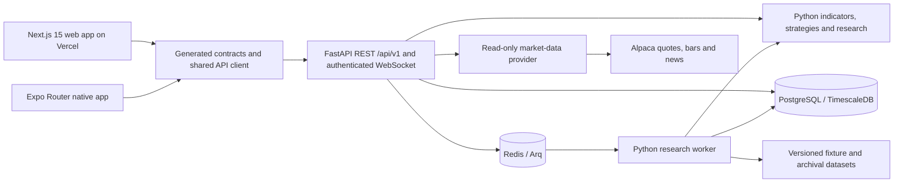
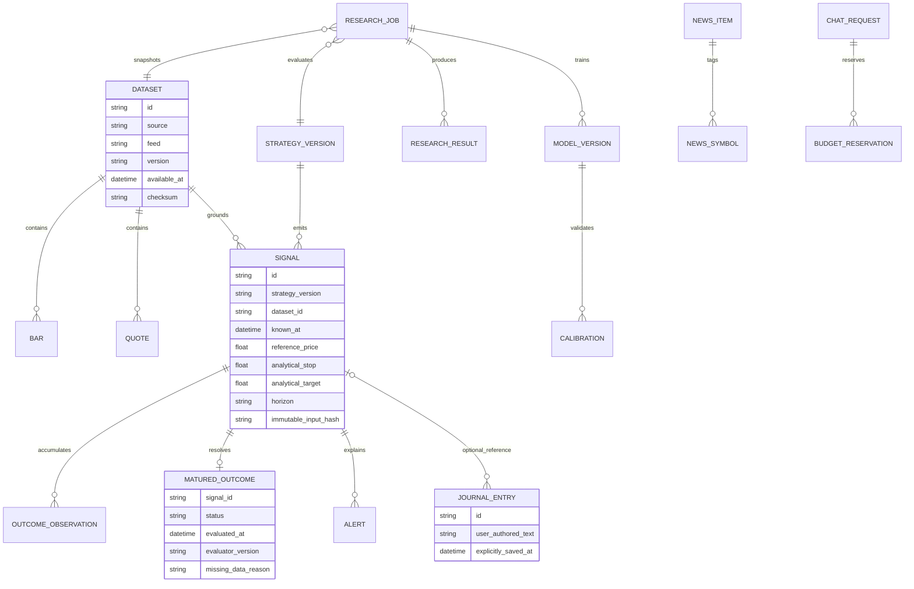

# SELERY architecture

Stock conversations add authenticated `/api/v1/conversations` create/list/detail/delete routes and `/api/v1/conversations/{id}/messages` for idempotent turns. A symbol is required and chart coverage is validated before creation; turns cannot change scope or supply forged history/roles. `conversations` and `conversation_messages` persist private threads independently of the journal. Each paid turn retrieves current market context for the chosen chart timeframe, replays bounded prior exchanges with dated provenance, and uses the existing atomic LLM allowance and `store:false`. Failed/interrupted turns remain explicit and are excluded from model history; restart recovery never automatically resends a possibly billed request. Clients show a chart beside/above the transcript and create separate threads for other stocks. Public-activity chat remains separate under its existing source-permission rules.

The accepted [Public Traders extension](docs/PUBLIC-TRADERS.md) adds source-specific `public_traders` → `public_activity` → `public_revisions` research tables, authenticated directory/activity/detail/refresh routes and activity-referenced chat on both clients. This is authorized third-party public evidence, independent of the user's brokerage state. The eToro adapter has a fixed host and three GET-only public-data operation families; Kinfo/AfterHour remain pending. Source permissions gate persistence and OpenAI processing separately. Missing snapshots do not infer exits; access withdrawal purges current and historic payloads when detected. Market charts retain separate IEX provenance and do not establish comparable exposure or realized returns. Public records are excluded from persistent client caches. See migration 002 and generated Python/TypeScript contracts for the physical schema and executable boundary.

This document defines the accepted system boundaries. Implementation and verification status belongs in PROGRESS.md and the wave reviews; a component shown here is not evidence that its deployment or device acceptance is complete.

> Selery is research software that displays analysis. It does not execute, recommend, or place trades.

## Components and ownership

| Component | Responsibility |
|---|---|
| `apps/web` | Desktop navigation, accessible controls, Lightweight Charts, research comparison tables, manual journal forms, and cookie-based session handling. |
| `apps/mobile` | Expo Router navigation, native detail sheets, SecureStore session storage, locally bundled WebView chart, cached reads, alerts inbox, and notification deep links. |
| `apps/api` | Python 3.12 FastAPI service; authentication, request validation, provider access, persistence, versioned contracts, and job orchestration. |
| `packages/shared` | Generated TypeScript contracts and runtime schemas, common API client, formatting, feature labels, chart configuration/markers, and design tokens. No quantitative calculations or provider secrets. |
| `packages/strategies` | Python strategy and analytical research logic. Strategies consume finalized point-in-time data and emit research signals. |
| `packages/fixtures` | Deterministic dataset samples, source metadata, availability timestamps, and checksums; synthetic examples explicitly identified. |
| `packages/ui` | Presentation primitives and tokens where sharing is appropriate; web DOM and native controls retain separate renderers. |

Python models are the contract source of truth. A reproducible generator emits the TypeScript boundary; CI fails if regeneration changes committed output. Both apps use the same generated types and API client. Clients may format data and handle chart gestures, but indicators, costs, sizing, labeling, statistics, signals, and outcomes are calculated in Python.

## Data and request flow

1. A personal login creates a short-lived session. The web surface uses an HttpOnly cookie; the native app retains the session in Expo SecureStore. Third-party credentials remain on the backend. Authentication protects REST and WebSocket data, and reconnects revalidate sessions.
2. Startup rejects any configured ALPACA_ENDPOINT other than the permitted HTTPS paper host before authenticated provider traffic. That endpoint is a credential guard; market-data traffic is restricted to the explicitly approved data host and read operations. No account query is required for credential verification.
3. Provider adapters explicitly select IEX for initial quotes and history. Every normalized record retains source, feed, event time, observation/availability time, freshness, and version. IEX and SIP histories have different dataset identities and storage keys.
4. Quantitative services receive only closed bars available at the evaluation timestamp. Resampling follows exchange sessions, including holidays and daylight-saving changes. Features are warmed up causally; future rows cannot change earlier signals.
5. REST returns paginated desktop results and compact mobile responses. The authenticated stream delivers quote, bar, signal, alert, and job updates. Clients reconcile snapshots after reconnection and display stale/cached status while disconnected.
6. Research and training requests enqueue bounded jobs. Arq workers persist status, immutable input versions, results, limitations, and failures. Expensive jobs and retraining require a manual trigger; no retraining schedule is enabled by default.

Backend feature policy is authoritative. IEX requests for VWAP, anchored VWAP, OBV, volume profile, unusual-volume alerts, volume-confirmed strategies, and volume-dependent alphas fail closed with **needs SIP data**. Both clients display that same limitation. Every IEX quote and volume display includes **IEX only**; spread data is not represented as NBBO. Historical SIP research explicitly discloses incompatibility with an IEX forward cohort.

## Logical data model

This ERD describes the domain relationships; migration files remain the authoritative physical schema.

TimescaleDB partitions time-series observations; dataset/source/feed are part of uniqueness keys. Redis holds transient delivery and queue state, not the only copy of signals or journal entries. Persistent jobs and model artifacts must be recoverable after worker restarts. Forward snapshots are immutable and duplicate ingestion is idempotent.

The user explicitly saves journal changes. Signal generation and outcome maturity never create journal entries. Sizing uses manually supplied analytical settings and returns an explanation of the calculation.

## Research and model correctness

Historical evaluation measures signal events: reference levels, threshold order, favorable/adverse excursions, and horizon outcomes. A result may be target-first, stop-first, neither, ambiguous, or incomplete/missing. When both thresholds occur in one bar without finer observations, ambiguity is preserved. Unknown data never becomes an assumed successful outcome.

Analytical costs are pure and versioned: commissions, dated regulatory schedules, spread assumptions, slippage, borrow, and impact. The initial SPY full-spread assumption is $0.02, with $0.01/$0.05 sensitivity cases. An assumed spread is labeled as such. IEX volume cannot estimate consolidated liquidity. Reports show raw and cost-adjusted event results with formulas, parameters, feed, and timestamps.

Calendar-aligned analytical return series have explicit overlap, exposure, and annualization assumptions before Sharpe or drawdown is reported. Matched cohorts share feeds, horizons, strategy versions, and denominators. Unsupported statistics return an unavailable reason. Reports include parameter-trial counts, benchmarks, publication timing, robustness evidence, and uncertainty where the sample supports them.

ML uses point-in-time features, triple-barrier/meta-labeling, purged validation with embargo, and preprocessing fitted only on training folds. Model versions retain dataset hashes, split definitions, feature versions, evaluation evidence, and calibration. Confidence and SHAP remain unavailable until a compatible evaluated model provides them. Manual baseline/sequence-model training stays outside request-serving work.

Read-only research chat accepts only approved research context and tools. LLM access defaults to disabled with a $0 cap. Atomic budget reservations occur before provider requests, reconcile afterward, and respect a global kill switch; uncertain requests retain a reservation until resolved. Multi-agent research is a manual job, and its output carries provenance and unavailable-data limitations.

## Client behavior and visual identity

Both surfaces use charcoal backgrounds, sage highlights, amber data limitations, muted red negative outcomes, Inter, and JetBrains Mono. The exact research disclaimer remains visible. Lightweight Charts runs directly on web and from a local bundle in the native WebView; no CDN is needed for offline chart rendering. Shared marker contracts identify the originating signal; native long-press opens a native detail sheet.

The cached view shows its last update and feed. Offline mode permits reading saved snapshots; it must not imply that stale signals or alerts are live. Controls that depend on unavailable data communicate the backend reason. TradingView attribution and its required link are visible on both surfaces, with exact license/notice text retained in distributed artifacts.

Real-iPhone acceptance measures pinch, pan, crosshair, marker long-press, and p95 local response below 100 ms with 2,000 displayed bars. A successful Expo bundle does not establish gesture performance. Expo Go is the initial preview; push notifications and TestFlight require a development/distribution build and their corresponding external account evidence.

## Operations and acceptance

Docker Compose supplies API, TimescaleDB, Redis, and Arq locally. Vercel serves the web app; Railway hosts the persistent API/worker/data deployment. The roughly $5/month target is a budget constraint, not a verified quote for all services. Measure baseline memory, CPU, storage, and manual-job peaks before provisioning a larger plan; do not silently increase spend. Backup/restore and health checks belong to deployment verification.

Tests run offline against fixtures. Coverage includes generated-contract parity, session rejection/expiry, data freshness, feed enforcement at API/job/alert boundaries, costs, warm-up, lookahead mutation, DST/session handling, ambiguous and incomplete outcomes, duplicate events, and explicit journal saves. Browser verification checks authenticated navigation and reconnection. Device, push, deployment and real-provider checks are separate evidence categories.

At every wave boundary, record the prescribed nine-part review and update progress, decisions, and debt. Independent tracks work in isolated worktrees against frozen contracts; only the integration agent changes the shared boundary. Fix failures before dependent integration. External accounts, entitlements, real-device measurements, and production monitoring remain pending until directly verified.
